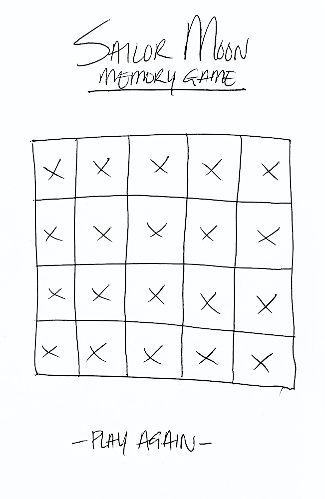
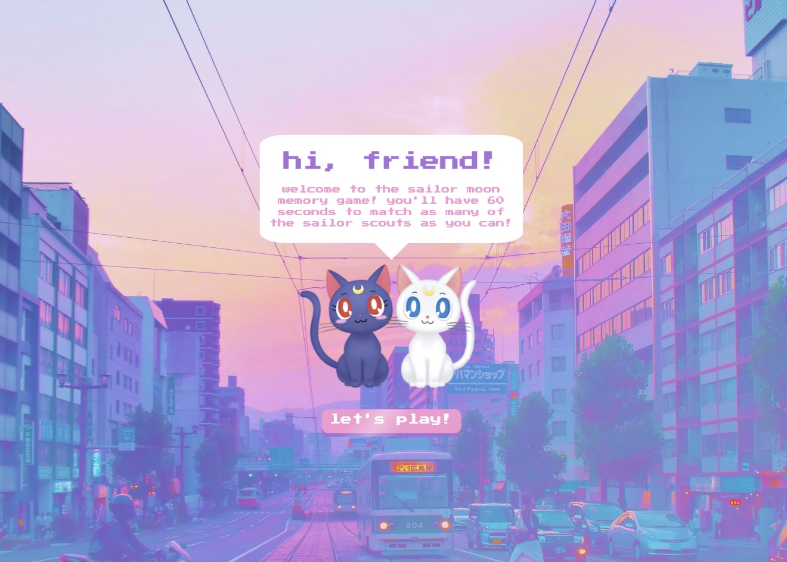
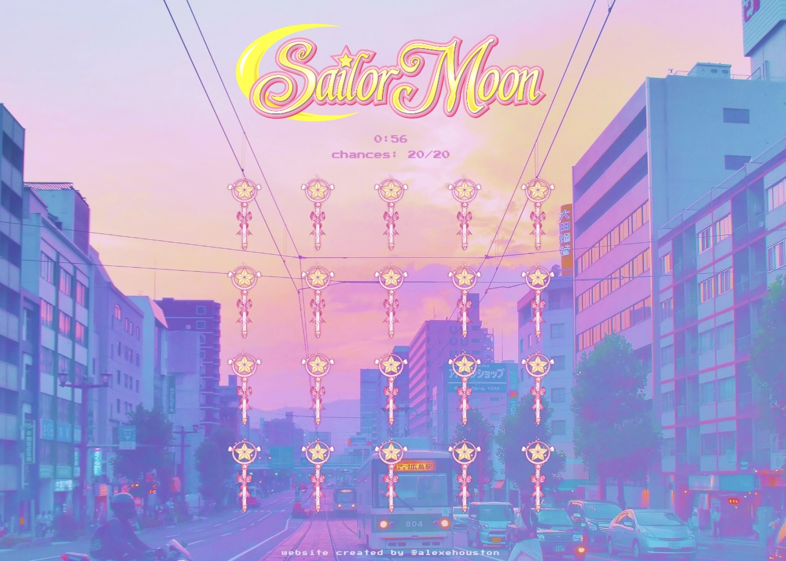
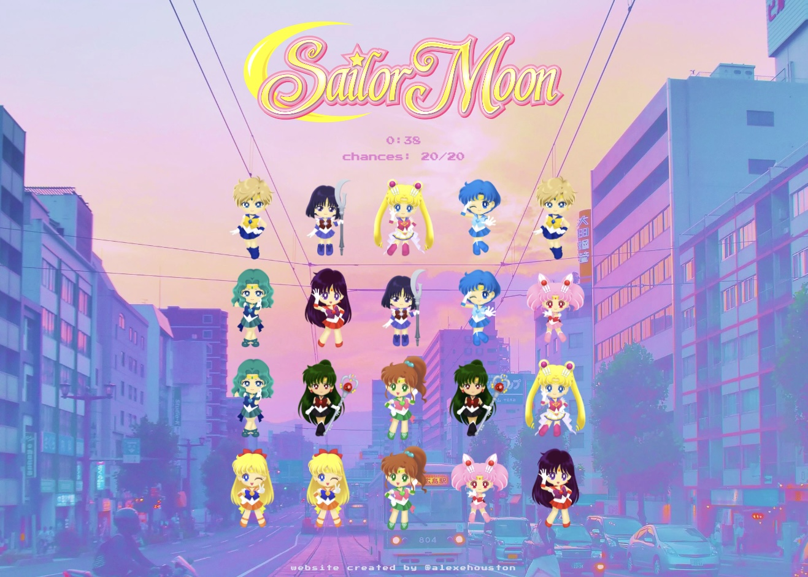
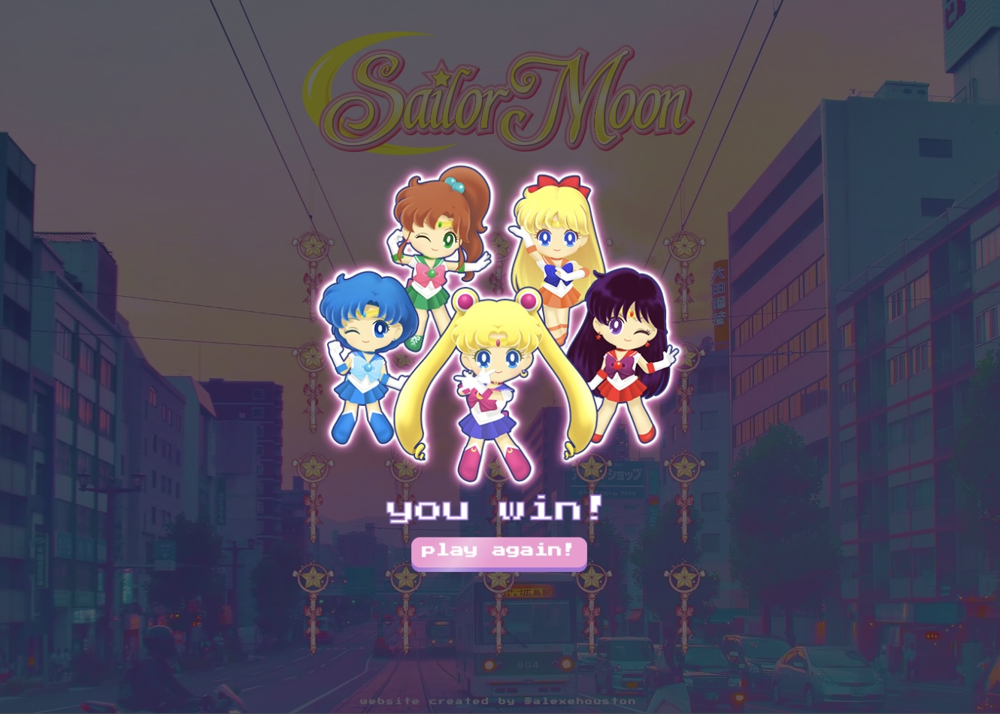
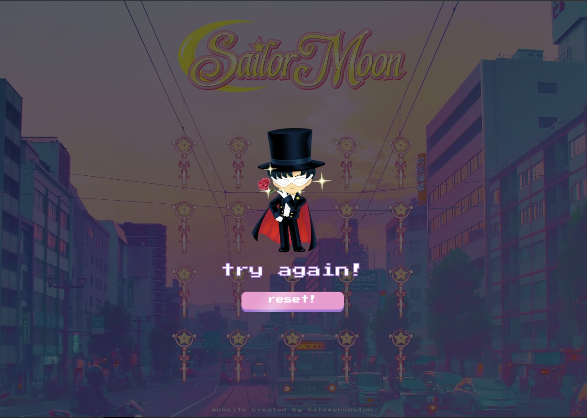

    

#

### [CLICK TO DEMO](https://alexehouston.github.io/concentration/)

##### Created by Alex E. Houston

## :pencil: Description

Concentration is a game in which cards are face down and
two cards are flipped over each turn. The object of the game
is to turn over pairs of matching cards within one minute.

    
:art: Wireframes

        <h3>Feed Page</h3>
        

    
:gear: Functionality

        <h3>Home Page</h3>
        
        <h3 align="center">Starter Board</h3>
        
        <h3 align="center">Complete Board</h3>
        
        <h3 align="center">Win Page</h3>
        
        <h3 align="center">Lose Page</h3>
        

## :computer: Technologies Used

<h2>:fire: Getting Started</h2>

<h3>:calling: Instructions</h3>

  
How to Play

  <ol>
    <li>
      X
    </li>
    <li>
      X
    </li>
  </ol>

<h3>:link: Links</h3>

  
Deployed Link

  Sailor Moon Concentration ()

## :fast_forward: Next Steps

### Upcoming Features

- [ ] Add 3 difficulty levels (decreasing total time + chances as difficulty increases)

- [ ] Add smoother animations when characters are chosen.